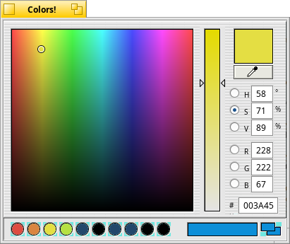

# Colors
**Colors!** is a color picker like that in Adobe Photoshop.
Find a color you want and use drag & drop to copy it to your application.

## License
MIT with the permission of the original author, Werner Freytag.

